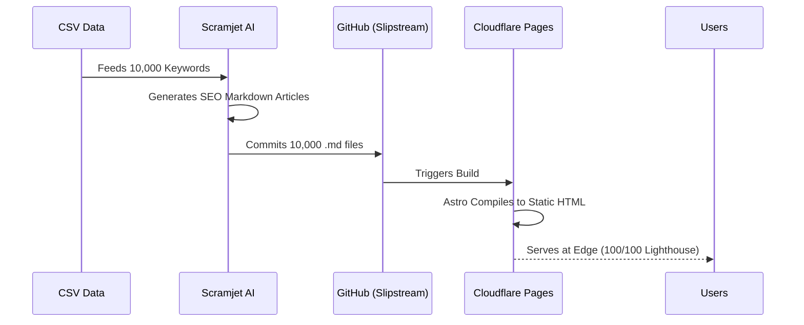

<div align="center">
  <h1>Slipstream</h1>
  <p><strong>A blazing fast, programmatic SEO engine for modern SaaS.</strong></p>
  <p>10,000 pages in seconds. 100/100 Lighthouse score. Powered by Astro and Tailwind CSS.</p>

  <!-- The 6-Badge Array -->
  <a href="https://slipstream.scramjet.io" target="_blank"></a>
  <a href="https://deploy.workers.cloudflare.com/?url=https://github.com/scramjetio/slipstream"></a>
  <a href="https://scramjet.io" target="_blank"></a>
  <a href="https://discord.gg/scramjetio" target="_blank"></a>
  <a href="https://github.com/scramjetio/slipstream/stargazers"></a>
  <a href="https://github.com/scramjetio/slipstream/actions"></a>
</div>

---

## ⚡️ Why Slipstream?

Programmatic SEO (pSEO) is the highest-ROI growth channel, but traditional CMS tools (like WordPress) crash or ruin your Core Web Vitals when you load 10,000 articles into them. Building a custom engine takes weeks.

**Slipstream** is the solution. It is an open-source, ultra-lightweight Astro template pre-configured specifically for generating massive organic traffic.

### Features
- 🚀 **Blazing Fast:** Compiles to 100% static HTML. Zero database queries at runtime.
- 🔍 **SEO Native:** Automatic XML sitemap generation, canonical URLs, and OpenGraph meta tags included out of the box.
- 🎨 **Minimalist Reader UI:** Clean, distraction-free reading experience optimized for high ad conversion and low bounce rates.

## 🎥 In Action
> **[TODO]:** Insert a 5-second WebP or GIF here showing the CLI building 10,000 pages in milliseconds.
*(Placeholder: ``)*

## 🚀 Quick Start

**Prerequisites:** Node.js >= 18.0

```bash
git clone https://github.com/scramjetio/slipstream.git my-pseo-blog
cd my-pseo-blog
npm install
npm run dev
```

## 🤖 The Trojan Horse: Powered by Scramjet

A blazing-fast engine is useless without content. Slipstream is designed to be the "Publishing Surface" for **Scramjet**, our automated event-driven pipeline.

If you don't want to manually write 500 localized SEO articles (e.g., "Best CRM in London", "Best CRM in Paris"), use Scramjet to:
1. Process a CSV of your target keywords or locations.
2. Use AI to generate unique, highly-optimized articles.
3. Automatically commit the Markdown files directly into this Slipstream repository.

*Learn more about automating your pSEO empire with Scramjet [here](https://scramjet.io).*

<details>
<summary><strong>🗺️ View Architecture Diagram</strong></summary>


</details>

## 📄 License
MIT © The Scramjet Team
